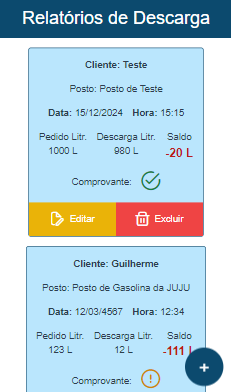
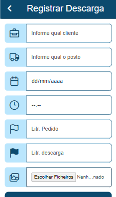

# Relatório de Faltas e Sobras
 
 

## Descrição
Essa é uma aplicação desenvolvida com o intuito de registrar descargas de cargas liquidas ( Gasolina, Alcool etc..). O usuário pode realizar o registro da descarga e anexar comprovantes, além disso pode também editar o relatório ou até mesmo excluir o mesmo. O sistema realiza um calculo e mostra se houve sobras ou faltas na descarga do produto.

## Funcionalidades Principais:
- **Interface Intuitiva:** Interface de usuário amigável e fácil de navegar, permitindo uma experiência de agradável.

- **Feedback Imediato:** Notificações visuais instantâneas idicando sucessos e erros.

- **Armazenamento:** Utiliza localStorage para armazenar os dados.

## Tecnologias utilizadas

- Vue.js
- Typescript
- Tailwindcss

## Realizar clone do projeto
Se você deseja explorar o projeto, pode cloná-lo usando o seguinte comando:

```bash
git clone https://github.com/guilhermeguimaraesn/quiz-da-programacao  
```
Depois de clonar o repositório, navegue até o diretório do projeto e instale as dependências necessárias:

```bash
cd descarga-rel
npm install

```
Esse comando realizará a instalação de todas as depedências e bibliotecas necessárias para manipular o projeto.

Para iniciar o projeto, use o comando:

```bash
npm run serve
```

Depois que tudo for instalado você pode utilizar a aplicação.

## Autor
Desenvolvido por [Guilherme Guimarães](https://github.com/guilhermeguimaraesn).

Para entrar em contato: [LinkedIn](https://www.linkedin.com/in/guilhermegn/) ou através do email [guilhermeguimaraesnas@gmail.com]().
